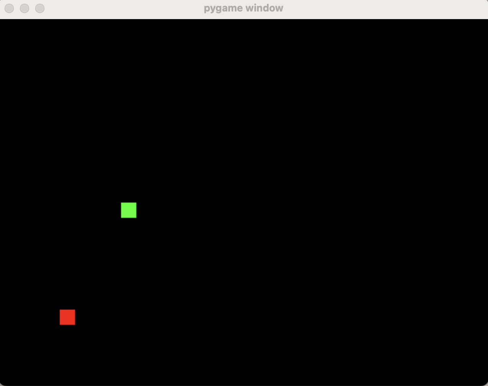

# Deep Q-Learning Snake Game

This project uses **Deep Q-Learning** (DQN) to train an AI agent to play the classic **Snake game**. The agent learns how to play by interacting with the game environment and improving its policy over time. The main components of the project are:

- **Pygame** for rendering the Snake game.
- **TensorFlow** for building and training the Q-network.
- **Replay Buffer** for storing experiences during training.

---

## Table of Contents

1. [Installation](#installation)
2. [How It Works](#how-it-works)
   - [Snake Game Environment](#snake-game-environment)
   - [DQN Agent](#dqn-agent)
   - [Training Process](#training-process)
3. [Gameplay Example](#gameplay-example)
4. [Training](#training)
5. [Hyperparameters](#hyperparameters)
6. [Evaluation](#evaluation)
7. [License](#license)

---

## Installation

To run this project, you need Python 3.x and the following libraries:

- `numpy`
- `pygame`
- `tensorflow`
- `keras`

### Steps to Install:

1. **Clone this repository**:

   ```bash
   git clone https://github.com/your-username/dqn-snake-game.git
   cd dqn-snake-game
   ```

2. **Install dependencies**:

   You can install the necessary dependencies using `pip` by running:

   ```bash
   pip install -r requirements.txt
   ```

---

## How It Works

### Snake Game Environment

The snake game is created using **Pygame**. The state of the game is represented as a 2D grid where:
- `1` represents the snake.
- `2` represents food.
- `0` represents empty spaces.

The game is initialized with a snake in the center of the screen, and food is randomly generated on the grid.



### DQN Agent

The agent uses **Deep Q-Learning** to learn optimal strategies for playing the game. The architecture consists of the following:

- **Q-Network**: The neural network model, with two hidden layers, each containing 128 neurons, and an output layer for Q-values corresponding to each action (up, down, left, right).
  
- **Replay Buffer**: Experiences (state, action, reward, next state, done) are stored and sampled for training. This helps the agent learn from past experiences and break correlations between consecutive states.

- **Target Network**: A target model is periodically updated to stabilize training and prevent oscillations during learning.

### Training Process

The agent interacts with the environment, selecting actions based on the current policy (via epsilon-greedy). After each action, the agent receives feedback (reward or penalty) and updates its Q-network using the loss between predicted and target Q-values.

The training loop continues for a set number of episodes (`max_epsilon_steps`), and the agent’s epsilon value decays over time to balance exploration and exploitation.

---

## Gameplay Example

### Initial Screen:
The initial state of the game shows the snake in the center of the screen, with food placed randomly.


### Game in Progress:
As the snake moves and eats food, its body grows longer, and it navigates the grid based on the agent's learned actions.


### End of Game:
The game ends if the snake collides with itself or the walls.


---

## Training

To start training the agent, run the following command in your terminal:

```bash
python snake.py
```

This will:

1. Initialize the **Snake game** environment.
2. Start training the **DQN agent**.
3. Print out the total reward after each episode.
4. Periodically update the target model.

Training will continue for the specified number of episodes (`max_epsilon_steps`). You can stop the training process at any time by pressing `Ctrl + C`.

---

## Hyperparameters

Here are the main hyperparameters used for training:

- **gamma**: Discount factor for future rewards (0.95)
- **epsilon**: Exploration rate, decreases over time (starts at 1.0, decays with each step)
- **epsilon_min**: Minimum epsilon value (0.01)
- **epsilon_decay**: Decay rate for epsilon (0.995)
- **learning_rate**: Learning rate for the optimizer (0.001)
- **batch_size**: Number of samples to use for training (64)
- **replay_buffer_size**: Size of the replay buffer (10000)
- **target_update_frequency**: Frequency at which the target model is updated (every 10 episodes)
- **max_steps**: Maximum number of steps per episode (10000)
- **max_epsilon_steps**: Number of episodes to train the agent (1000)

---

## Evaluation

After training, the agent should be able to navigate the snake and eat food efficiently without colliding with itself or the walls. To visualize how well the agent performs, you can run the evaluation script:

```bash
python evaluate_snake.py
```

This will run the trained agent on the game without any further training and display its performance.

---

## License

This project is licensed under the MIT License - see the [LICENSE](LICENSE) file for details.

---

### Images

- **Initial Game State**: The snake starts in the center of the screen, and food is placed randomly.
- **Game in Progress**: The snake moves and eats food, and its body grows after eating.
- **Game Over**: The game ends when the snake collides with itself or the walls.

---

## Conclusion

This project demonstrates how **Deep Q-Learning** can be applied to a classic game like Snake. The agent learns optimal policies through trial and error, interacting with the game environment. The project uses **Pygame** for rendering the game and **TensorFlow** for training the neural network model. It's an excellent starting point for exploring reinforcement learning algorithms in Python.

---

### Notes

- You can modify the `train_snake.py` file to experiment with different hyperparameters or add features such as visualizing the training progress.
- If you encounter any issues or have suggestions for improvements, feel free to open an issue or contribute to the project.

---
